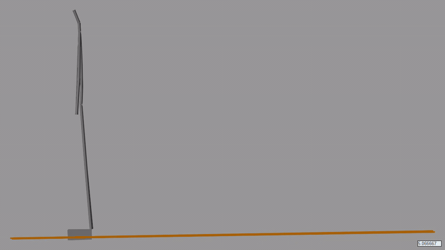
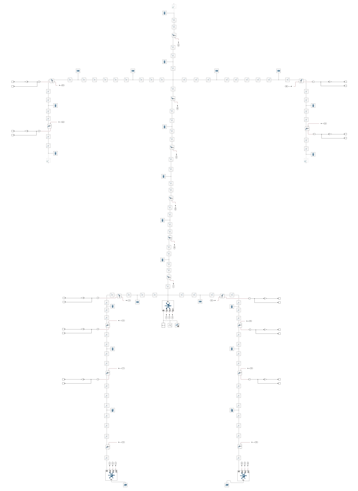
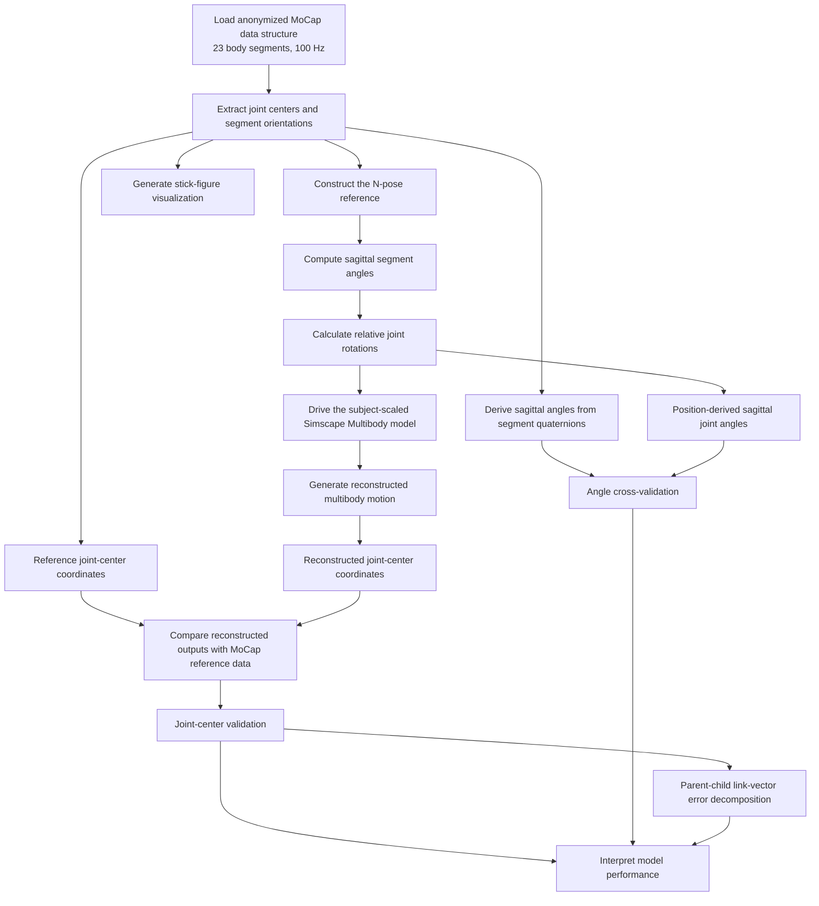

# Subject-Specific Sagittal Human Motion Reconstruction

A technical portfolio presentation of a MATLAB/Simulink and Simscape Multibody workflow for reconstructing subject-specific sagittal human motion from anonymized full-body motion-capture data and evaluating the reconstruction through joint-center, joint-angle, and parent-child link analyses.

## Motion reconstruction preview

The animation below shows the subject-specific sagittal motion reconstructed in Simscape Multibody.

[](docs/visual/human_motion_reconstruction_model.mp4)

**[Open the full-resolution MP4 video](docs/visual/human_motion_reconstruction_model.mp4)**

## Project overview

The pipeline processes a 23-segment anonymized motion-capture dataset and reconstructs a 20 s motion interval surrounding Achilles-tendon vibration. Global joint-center coordinates and segment-orientation quaternions are used to:

- construct a subject-specific N-pose reference,
- calculate sagittal segment inclinations,
- derive relative joint rotations,
- drive a subject-scaled Simscape Multibody human model,
- generate a coordinate-based stick-figure visualization,
- and perform quantitative kinematic validation.

The validation framework evaluates the model at three levels:

1. **Joint-center reconstruction** in the sagittal `x-z` plane.
2. **Joint-angle cross-validation** between position-derived angles and angles derived from motion-capture segment-orientation quaternions.
3. **Parent-child link-vector analysis** that separates fixed geometric bias from time-varying dynamic residual error.

## Public portfolio scope

This repository is a technical showcase of the project architecture, computational methodology, motion-reconstruction results, and quantitative validation.

The complete MATLAB implementation, Simscape Multibody model, and motion-capture dataset are maintained separately and are not distributed in this public repository.

## Main technical contributions

- Developed an end-to-end motion-capture-to-simulation workflow in MATLAB and Simscape Multibody.
- Parameterized a 23-segment human model using subject-specific segment geometry.
- Derived sagittal segment inclinations from joint-center position vectors relative to an N-pose.
- Converted absolute segment inclinations into relative joint rotations for the multibody chain.
- Reconstructed measured postural motion in a multibody simulation environment.
- Verified position-derived joint angles against quaternion-derived sagittal angles.
- Quantified joint-center discrepancies through parent-child link-vector analysis.
- Distinguished fixed anatomical and frame-placement offsets from time-varying kinematic residuals.

## Model architecture

The project is built around a subject-scaled, 23-segment multibody representation of the human body. The architecture combines measurement-derived segment geometry, prescribed pelvis translation, sagittal relative joint rotations, and model-based joint-center reconstruction.

The Simscape Multibody model contains interconnected spinal, upper-limb, pelvic, lower-limb, foot, and toe-root chains. Kinematic inputs calculated in MATLAB drive the corresponding joints, while model outputs provide reconstructed segment poses and joint-center coordinates for visualization and validation.

### Simscape Multibody model overview

The figure below shows the subject-scaled multibody architecture used for sagittal motion reconstruction.



## Engineering workflow



## Implementation logic

The following pseudocode summarizes the computational workflow without disclosing the complete MATLAB/Simulink implementation.

### Motion reconstruction

```text
INPUT:
    anonymized motion-capture structure

    1. Read joint-center coordinates and segment orientations.
    2. Identify the ordered body-segment structure.
    3. Construct a subject-specific N-pose reference.
    4. Compute segment lengths and sagittal segment inclinations.
    5. Convert absolute segment inclinations into relative joint rotations.
    6. Apply pelvis translation and joint rotations to the multibody model.
    7. Simulate the selected motion interval.
    8. Store reconstructed joint centers and segment poses.

OUTPUT:
    reconstructed joint-center trajectories
    reconstructed segment poses
    animated full-body motion
```

### Sagittal joint-angle calculation

```text
FOR each selected body segment:
    project the segment vector onto the sagittal x-z plane
    compute the absolute segment inclination relative to the N-pose

FOR each modeled joint:
    relative_joint_angle = distal_segment_angle - proximal_segment_angle

RETURN:
    time-varying sagittal joint rotations
```

### Validation procedure

```text
INPUT:
    reconstructed model outputs
    reference MoCap outputs

FOR each joint center:
    compute frame-by-frame sagittal position error
    compute mean error, RMSE, and maximum error

FOR each joint angle:
    compare position-derived and quaternion-derived trajectories
    compute angular error metrics

FOR each parent-child link:
    compare model and MoCap link vectors
    compute the fixed geometric bias
    compute the time-varying dynamic residual

OUTPUT:
    quantitative validation metrics
    diagnostic figures
    interpretation of geometric and kinematic discrepancies
```

## Key findings

- Position-derived and quaternion-derived sagittal joint angles overlap closely across the spine, hips, knees, shoulders, and elbows.
- Most non-ankle angular errors remain at numerical-noise scale.
- Ankle errors remain below approximately `0.1 deg`.
- The spinal chain is reconstructed with sub-millimetre numerical error.
- The T8-to-shoulder-root geometry is consistent after anatomical point matching.
- The largest upper-limb joint-center differences originate mainly from fixed shoulder-to-upper-arm and upper-arm-to-forearm geometric offsets rather than time-varying angle errors.
- Lower-limb joint-center differences are dominated by small fixed pelvis-to-hip offsets.
- The left foot-to-toe connection contains an additional fixed geometric discrepancy.
- Dynamic residuals are substantially smaller than the dominant fixed biases in the links with the largest absolute errors. This indicates consistent temporal motion reconstruction, while the remaining discrepancies arise primarily from fixed landmark and frame-definition offsets rather than time-varying kinematic errors.

## Validation results

### Joint-center reconstruction


### Angle cross-validation

The position-derived and quaternion-derived sagittal joint-angle trajectories show close agreement across the evaluated joints.


### Parent-child link-vector decomposition

The link-vector error is decomposed into a fixed geometric bias and a time-varying dynamic residual, allowing static landmark differences to be distinguished from motion-dependent reconstruction errors.


## Scope and limitations

This project demonstrates a **kinematically driven sagittal-plane reconstruction**, not a predictive neuromusculoskeletal simulation.

- The model replays measured motion; it does not predict motion from muscle forces or joint torques.
- The represented motion is restricted to the sagittal plane.
- Joint-angle verification compares two outputs from the same motion-capture processing workflow: joint-center positions and segment orientations.
- The validation is therefore an internal kinematic cross-check rather than an independent optical-motion-capture validation.
- Segment masses and inertial properties are not intended for validated inverse-dynamics calculations.
- Remaining position differences partly reflect different anatomical landmark and frame definitions between the Simscape model and MoCap structure.

## Repository contents

This public repository includes:

- project and model architecture descriptions,
- engineering workflow diagrams and implementation pseudocode,
- a Simscape Multibody model overview,
- representative motion-reconstruction visualizations,
- quantitative validation figures,
- technical reports in Markdown and PDF formats.

## Repository structure

```text
.
├── README.md
├── LICENSE.md
├── CITATION.cff
└── docs/
    ├── TECHNICAL_REPORT.md
    ├── TECHNICAL_REPORT.pdf
    ├── figures/
    │   ├── simscape_model_overview.png
    │   ├── Validation - Position summary.png
    │   ├── Validation - Position errors.png
    │   ├── Validation - Angle comparison.png
    │   ├── Validation - Angle summary.png
    │   ├── Validation - Angle errors.png
    │   ├── Validation - Link error decomposition.png
    │   ├── Validation - Link error time series.png
    │   ├── Validation - Link length comparison.png
    │   └── Validation - Link bias components.png
    └── visual/
        ├── motion_20x.gif
        └── human_motion_reconstruction_model.mp4
```

## Technology stack

- MATLAB
- Simulink
- Simscape
- Simscape Multibody

The portfolio version was verified with MATLAB R2025b.

## Technical Documentation

A detailed discussion of the model architecture, mathematical formulation, validation approach, results, and limitations is available in:

- [Technical Report - Markdown](docs/TECHNICAL_REPORT.md)
- [Technical Report - PDF](docs/TECHNICAL_REPORT.pdf)

## Implementation and data availability

The complete source code, Simscape Multibody model, and anonymized motion-capture dataset are maintained in a separate private repository and are not publicly distributed.

This public repository contains only derived figures, visualizations, aggregated validation results, and technical documentation.

Limited access to the complete implementation may be provided upon request for professional or academic evaluation. Access to the materials in this public repository is provided solely for evaluation and does not grant permission to reuse, modify, redistribute, republish, or incorporate them into another project.

## License and permitted use

Copyright © 2021-2026 Renan Arda Carlak. All rights reserved.

This repository and its contents are proprietary and are provided solely for portfolio presentation, recruitment review, professional evaluation, and academic review.

Viewing and downloading the publicly available materials for evaluation are permitted. Reuse, modification, redistribution, publication, incorporation into another project, or commercial or non-commercial application are not permitted without prior written authorization.

See the [Proprietary Evaluation-Only License](LICENSE.md) for the complete terms.

## Citation

Citation information is provided in [CITATION.cff](CITATION.cff).

Citation does not grant permission to reuse, modify, redistribute, or republish the project.

## Author

**Renan Arda Carlak**  
Simulation and Computational Modeling Engineer  
Biomechanics | MATLAB/Simulink | Multibody Dynamics
